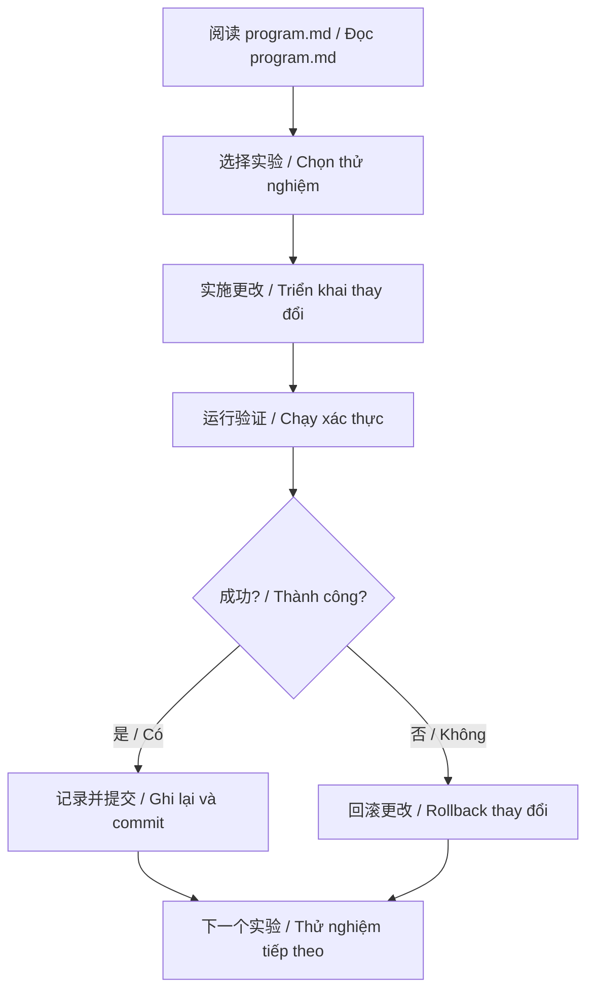

# AutoResearch 集成到集运系统项目
# Tích hợp AutoResearch vào Dự án Hệ thống Tập vận

## 概述 / Tổng quan

我们已经成功地将 [karpathy/autoresearch](https://github.com/karpathy/autoresearch) 的核心理念应用到我们的前端开发流程中。虽然原始项目用于 ML 模型训练，但我们将其方法论适配为 React 组件的持续改进系统。

Chúng ta đã áp dụng thành công ý tưởng cốt lõi của [karpathy/autoresearch](https://github.com/karpathy/autoresearch) vào quy trình phát triển frontend của chúng ta. Mặc dù dự án gốc dùng cho training mô hình ML, nhưng chúng ta đã điều chỉnh phương pháp luận của nó thành hệ thống cải thiện liên tục cho các component React.

## 核心适配 / Điều chỉnh Cốt lõi

### 原始 AutoResearch / AutoResearch Gốc

```python
# train.py - AI 代理修改这个文件
# AI agent sửa đổi file này
model = GPT(...)
optimizer = Muon(...)
# 训练 5 分钟，评估 val_bpb
# Training 5 phút, đánh giá val_bpb
```

### 我们的适配 / Điều chỉnh của Chúng ta

```typescript
// HomePage.tsx - AI 代理改进这个组件
// AI agent cải thiện component này
export default function HomePage({...}) {
  // 组件代码
  // Code component
}
// 验证编译，测试功能，评估指标
// Xác thực biên dịch, kiểm tra chức năng, đánh giá chỉ số
```

## 关键映射 / Ánh xạ Chính

| AutoResearch 概念 / Khái niệm | 我们的实现 / Triển khai của chúng ta |
|---|---|
| **训练脚本 (train.py)** / **Script training** | **React 组件 (HomePage.tsx)** / **Component React** |
| **ML 模型参数** / **Tham số mô hình ML** | **组件代码结构** / **Cấu trúc code component** |
| **验证损失 (val_bpb)** / **Loss xác thực** | **代码质量指标** / **Chỉ số chất lượng code** |
| **5 分钟训练** / **Training 5 phút** | **快速验证周期** / **Chu kỳ xác thực nhanh** |
| **GPU 计算** / **Tính toán GPU** | **开发环境** / **Môi trường phát triển** |
| **自主实验** / **Thử nghiệm tự động** | **系统化改进** / **Cải thiện có hệ thống** |

## 项目结构 / Cấu trúc Dự án

```
jiyunxitong/
├── Shipping-Delivery_Module/     # 主项目 / Dự án chính
│   └── src/
│       └── components/
│           ├── HomePage.tsx       # 改进目标 / Mục tiêu cải thiện
│           ├── PackageList.tsx
│           └── ...
│
└── autoresearch-frontend/         # AutoResearch 系统 / Hệ thống AutoResearch
    ├── README.md                  # 使用指南 / Hướng dẫn sử dụng
    ├── program.md                 # AI 代理指令 / Hướng dẫn AI agent
    ├── experiment-log.md          # 实验日志 / Log thử nghiệm
    └── EXAMPLE-EXPERIMENT.md      # 示例实验 / Thử nghiệm mẫu
```

## 使用场景 / Trường hợp Sử dụng

### 场景 1: 日常开发改进 / Kịch bản 1: Cải thiện Phát triển Hàng ngày

**问题 / Vấn đề:**
组件变得越来越复杂，难以维护。
Component ngày càng phức tạp, khó bảo trì.

**解决方案 / Giải pháp:**
```bash
# 1. 查看改进建议
cat autoresearch-frontend/program.md

# 2. 选择一个实验
# 例如：提取 ProjectCard 组件
# Ví dụ: Trích xuất component ProjectCard

# 3. 实施更改
# 创建新组件，更新 HomePage
# Tạo component mới, cập nhật HomePage

# 4. 验证
cd Shipping-Delivery_Module
npm run build && npm run dev

# 5. 记录结果
# 在 experiment-log.md 中记录
# Ghi lại trong experiment-log.md
```

### 场景 2: 性能优化 / Kịch bản 2: Tối ưu Hiệu suất

**问题 / Vấn đề:**
组件重新渲染过于频繁。
Component re-render quá thường xuyên.

**解决方案 / Giải pháp:**
```typescript
// 实验：添加 React.memo
// Thử nghiệm: Thêm React.memo

import { memo } from 'react';

const ProjectCard = memo(function ProjectCard({...props}) {
  // 组件代码
  // Code component
});

// 测量：使用 React DevTools Profiler
// Đo lường: Sử dụng React DevTools Profiler
// 记录：渲染次数减少 X%
// Ghi lại: Giảm X% số lần render
```

### 场景 3: 可访问性改进 / Kịch bản 3: Cải thiện Khả năng Truy cập

**问题 / Vấn đề:**
组件缺少 ARIA 标签和键盘导航。
Component thiếu nhãn ARIA và điều hướng bàn phím.

**解决方案 / Giải pháp:**
```typescript
// 实验：添加可访问性功能
// Thử nghiệm: Thêm tính năng khả năng truy cập

<button
  onClick={handleClick}
  aria-label="Navigate to package management"
  onKeyDown={handleKeyDown}
  role="button"
  tabIndex={0}
>
  {/* 内容 / Nội dung */}
</button>

// 验证：使用 axe DevTools
// Xác thực: Sử dụng axe DevTools
// 记录：可访问性分数提高
// Ghi lại: Điểm khả năng truy cập tăng
```

## 工作流程 / Quy trình Làm việc

### 手动模式 / Chế độ Thủ công



### AI 辅助模式 / Chế độ Hỗ trợ AI

```bash
# 1. 启动 AI 助手（Claude、GPT-4 等）
# Khởi động AI assistant (Claude, GPT-4, v.v.)

# 2. 提供上下文
"请阅读 autoresearch-frontend/program.md，
然后帮我执行第一个实验。"

# 3. AI 执行实验
# - 分析组件 / Phân tích component
# - 实施更改 / Triển khai thay đổi
# - 验证结果 / Xác thực kết quả

# 4. 人工审查
# - 检查代码质量 / Kiểm tra chất lượng code
# - 测试功能 / Kiểm tra chức năng
# - 决定保留或回滚 / Quyết định giữ hoặc rollback
```

## 实际示例 / Ví dụ Thực tế

### 实验 #1: 提取 ProjectCard 组件 / Thử nghiệm #1: Trích xuất Component ProjectCard

**之前 / Trước:**
- HomePage.tsx: 121 行代码
- HomePage.tsx: 121 dòng code
- 复杂度：高
- Độ phức tạp: Cao
- 可重用性：低
- Khả năng tái sử dụng: Thấp

**之后 / Sau:**
- HomePage.tsx: 85 行代码 (-30%)
- HomePage.tsx: 85 dòng code (-30%)
- ProjectCard.tsx: 45 行代码（新）
- ProjectCard.tsx: 45 dòng code (mới)
- 复杂度：中
- Độ phức tạp: Trung bình
- 可重用性：高
- Khả năng tái sử dụng: Cao

**结果 / Kết quả:** ✅ KEEP

详细信息请参见：`autoresearch-frontend/EXAMPLE-EXPERIMENT.md`
Chi tiết xem tại: `autoresearch-frontend/EXAMPLE-EXPERIMENT.md`

## 指标跟踪 / Theo dõi Chỉ số

### 代码质量指标 / Chỉ số Chất lượng Code

```typescript
// 可以使用工具自动收集
// Có thể thu thập tự động bằng công cụ

interface CodeMetrics {
  linesOfCode: number;           // 代码行数 / Số dòng code
  cyclomaticComplexity: number;  // 圈复杂度 / Độ phức tạp vòng lặp
  typeScriptErrors: number;      // TS 错误数 / Số lỗi TS
  componentCount: number;        // 组件数量 / Số component
  reusabilityScore: number;      // 可重用性分数 / Điểm tái sử dụng
}
```

### 性能指标 / Chỉ số Hiệu suất

```typescript
interface PerformanceMetrics {
  renderCount: number;           // 渲染次数 / Số lần render
  renderTime: number;            // 渲染时间 (ms) / Thời gian render
  bundleSize: number;            // 打包大小 (KB) / Kích thước bundle
  memoryUsage: number;           // 内存使用 (MB) / Sử dụng bộ nhớ
}
```

### 可访问性指标 / Chỉ số Khả năng Truy cập

```typescript
interface AccessibilityMetrics {
  ariaLabels: number;            // ARIA 标签数 / Số nhãn ARIA
  keyboardNavigation: boolean;   // 键盘导航 / Điều hướng bàn phím
  colorContrast: number;         // 颜色对比度 / Độ tương phản màu
  screenReaderSupport: boolean;  // 屏幕阅读器支持 / Hỗ trợ đọc màn hình
}
```

## 最佳实践 / Thực hành Tốt nhất

### ✅ 推荐做法 / Nên làm

1. **每天运行 1-3 个实验**
   - 保持稳定的改进节奏
   - Giữ nhịp độ cải thiện ổn định

2. **详细记录每个实验**
   - 帮助学习和未来参考
   - Giúp học hỏi và tham khảo tương lai

3. **小步快跑**
   - 小的更改更容易验证
   - Thay đổi nhỏ dễ xác thực hơn

4. **测量一切**
   - 数据驱动的决策
   - Quyết định dựa trên dữ liệu

5. **快速失败**
   - 不要害怕回滚
   - Đừng ngại rollback

### ❌ 避免做法 / Tránh làm

1. **不要一次改太多**
   - 难以确定什么有效
   - Khó xác định cái gì hiệu quả

2. **不要跳过验证**
   - 可能引入 bug
   - Có thể đưa vào bug

3. **不要忽略文档**
   - 未记录的学习会丢失
   - Học hỏi không ghi lại sẽ mất

4. **不要盲目优化**
   - 先测量，再优化
   - Đo lường trước, tối ưu sau

## 与原始 AutoResearch 的对比 / So sánh với AutoResearch Gốc

### 相似之处 / Điểm Giống

1. **自主实验** - 系统化的改进方法
2. **Thử nghiệm Tự động** - Phương pháp cải thiện có hệ thống
3. **快速迭代** - 小的、专注的更改
4. **Lặp Nhanh** - Thay đổi nhỏ, tập trung
5. **指标驱动** - 基于数据的决策
6. **Dựa trên Chỉ số** - Quyết định dựa trên dữ liệu
7. **持续改进** - 永不停止的优化
8. **Cải thiện Liên tục** - Tối ưu không ngừng

### 差异之处 / Điểm Khác

1. **领域不同** - ML 训练 vs 前端开发
2. **Lĩnh vực Khác** - Training ML vs Phát triển frontend
3. **语言不同** - Python vs TypeScript
4. **Ngôn ngữ Khác** - Python vs TypeScript
5. **硬件需求** - GPU vs 标准开发环境
6. **Yêu cầu Phần cứng** - GPU vs Môi trường phát triển tiêu chuẩn
7. **时间预算** - 固定 5 分钟 vs 灵活
8. **Ngân sách Thời gian** - Cố định 5 phút vs Linh hoạt

## 未来扩展 / Mở rộng Tương lai

### 1. 自动化脚本 / Script Tự động

```javascript
// auto-improve.js
// 可以创建脚本来自动化整个流程
// Có thể tạo script để tự động hóa toàn bộ quy trình

const runExperiment = async () => {
  // 1. 读取 program.md
  // 2. 调用 AI API 生成改进
  // 3. 应用更改
  // 4. 运行验证
  // 5. 记录结果
  // 6. 提交或回滚
};
```

### 2. CI/CD 集成 / Tích hợp CI/CD

```yaml
# .github/workflows/autoresearch.yml
name: AutoResearch Experiments

on:
  schedule:
    - cron: '0 2 * * *'  # 每天凌晨 2 点运行 / Chạy lúc 2 giờ sáng mỗi ngày

jobs:
  experiment:
    runs-on: ubuntu-latest
    steps:
      - name: Run experiment
      - name: Validate changes
      - name: Create PR if successful
```

### 3. 指标仪表板 / Dashboard Chỉ số

```typescript
// 可视化改进进度
// Trực quan hóa tiến độ cải thiện

interface Dashboard {
  totalExperiments: number;
  successRate: number;
  codeQualityTrend: number[];
  performanceTrend: number[];
  accessibilityTrend: number[];
}
```

## 总结 / Tóm tắt

我们成功地将 AutoResearch 的核心理念应用到前端开发中：
Chúng ta đã áp dụng thành công ý tưởng cốt lõi của AutoResearch vào phát triển frontend:

1. **系统化方法** - 明确的实验协议
2. **Phương pháp Có hệ thống** - Quy trình thử nghiệm rõ ràng
3. **可测量改进** - 跟踪具体指标
4. **Cải thiện Đo lường được** - Theo dõi chỉ số cụ thể
5. **快速迭代** - 小的、专注的更改
6. **Lặp Nhanh** - Thay đổi nhỏ, tập trung
7. **持续学习** - 记录和应用经验
8. **Học hỏi Liên tục** - Ghi lại và áp dụng kinh nghiệm

虽然我们的项目与原始 AutoResearch 的领域完全不同，但核心方法论是通用的，可以应用于任何需要持续改进的系统。
Mặc dù dự án của chúng ta hoàn toàn khác lĩnh vực với AutoResearch gốc, nhưng phương pháp luận cốt lõi là phổ quát và có thể áp dụng cho bất kỳ hệ thống nào cần cải thiện liên tục.

## 下一步 / Bước Tiếp theo

1. **开始第一个实验**
   - 参考 `autoresearch-frontend/EXAMPLE-EXPERIMENT.md`
   - Tham khảo `autoresearch-frontend/EXAMPLE-EXPERIMENT.md`

2. **建立基线指标**
   - 为所有组件记录当前状态
   - Ghi lại trạng thái hiện tại cho tất cả component

3. **定期运行实验**
   - 每天 1-3 个实验
   - 1-3 thử nghiệm mỗi ngày

4. **分享学习**
   - 更新 program.md 和 experiment-log.md
   - Cập nhật program.md và experiment-log.md

让我们开始改进我们的代码库，一次一个实验！
Hãy bắt đầu cải thiện codebase của chúng ta, từng thử nghiệm một!
